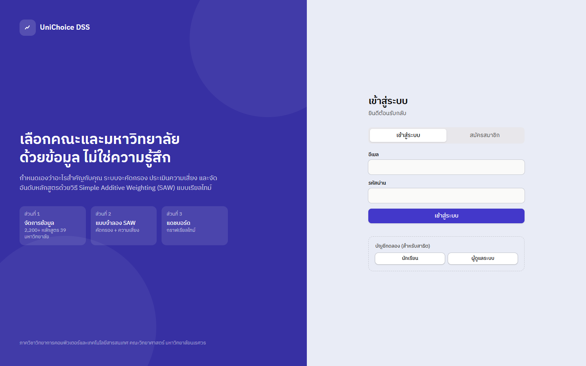
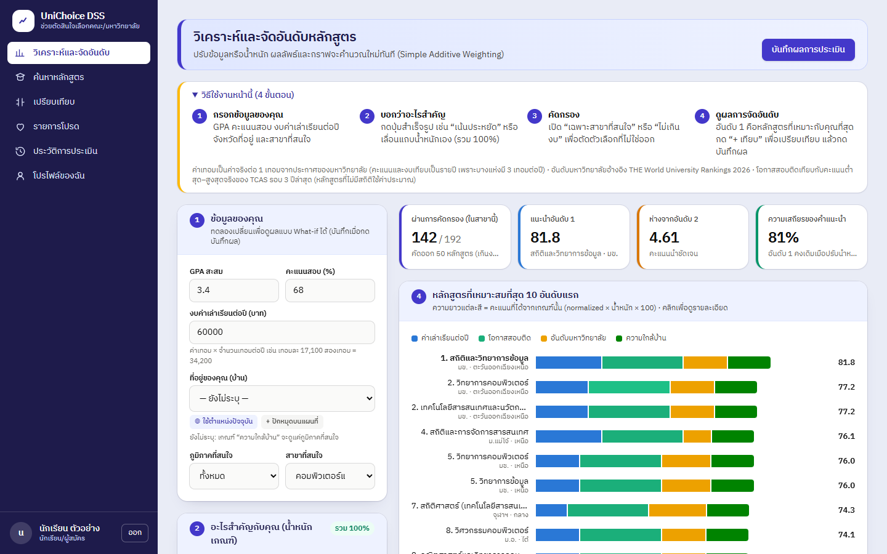
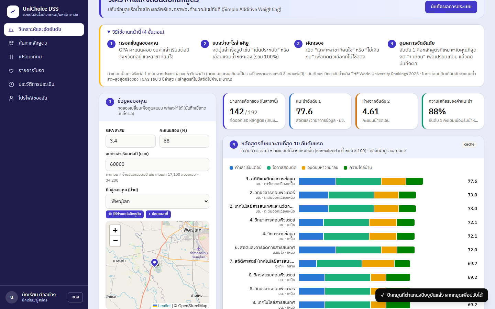
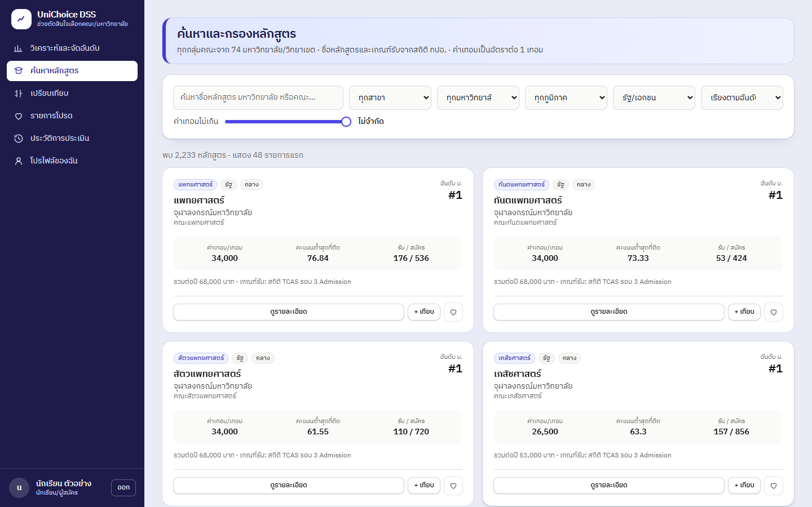
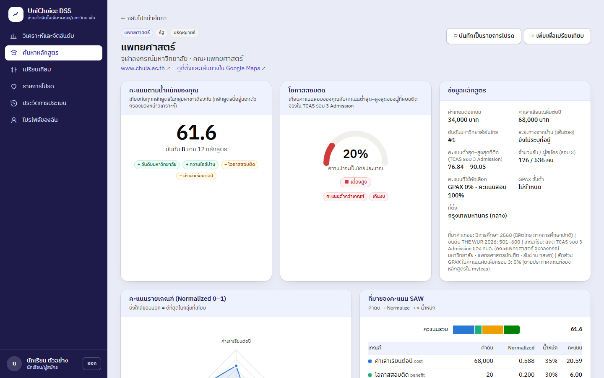
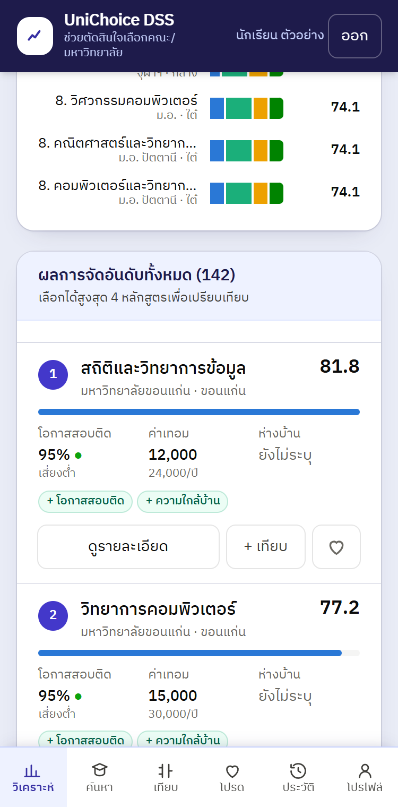

# คู่มือการใช้งาน UniChoice DSS

UniChoice DSS ช่วยเลือกหลักสูตรและมหาวิทยาลัยที่เหมาะกับคุณ โดยให้คุณบอกข้อมูลของตัวเองและบอกว่าให้ความสำคัญกับเรื่องไหน แล้วระบบจัดอันดับหลักสูตรให้

คู่มือนี้อธิบายการใช้งานหน้าเว็บ ส่วนวิธีติดตั้งและที่มาของข้อมูลอยู่ใน [README](../README.md)

## สารบัญ

1. [เข้าสู่ระบบ](#1-เข้าสู่ระบบ)
2. [หาหลักสูตรที่เหมาะกับคุณ](#2-หาหลักสูตรที่เหมาะกับคุณ)
3. [ระบุที่อยู่และดูระยะทาง](#3-ระบุที่อยู่และดูระยะทาง)
4. [อ่านผลการจัดอันดับ](#4-อ่านผลการจัดอันดับ)
5. [ค้นหา เปรียบเทียบ และบันทึกหลักสูตร](#5-ค้นหา-เปรียบเทียบ-และบันทึกหลักสูตร)
6. [ใช้งานบนโทรศัพท์](#6-ใช้งานบนโทรศัพท์)
7. [สำหรับผู้ดูแลระบบ](#7-สำหรับผู้ดูแลระบบ)
8. [คำถามที่พบบ่อย](#8-คำถามที่พบบ่อย)

## 1. เข้าสู่ระบบ

- **มีบัญชีแล้ว:** กรอกอีเมลและรหัสผ่าน แล้วกดเข้าสู่ระบบ
- **ยังไม่มีบัญชี:** กดแท็บสมัครสมาชิก กรอกชื่อ อีเมล และรหัสผ่าน
- **ทดลองใช้:** กดปุ่ม "นักเรียน" หรือ "ผู้ดูแลระบบ" ใต้หัวข้อบัญชีทดลอง ระบบจะเข้าให้ทันที

| บัญชีทดลอง | อีเมล | รหัสผ่าน |
|---|---|---|
| นักเรียน | `student@dss.local` | `student1234` |
| ผู้ดูแลระบบ | `admin@dss.local` | `admin1234` |

ออกจากระบบด้วยปุ่ม "ออก" ที่มุมล่างซ้ายบนคอมพิวเตอร์ หรือมุมขวาบนบนโทรศัพท์

## 2. หาหลักสูตรที่เหมาะกับคุณ

เปิดเมนู **วิเคราะห์และจัดอันดับ** แล้วทำตามกล่องหมายเลข 1 ถึง 4 ผลลัพธ์คำนวณใหม่ทันทีทุกครั้งที่คุณเปลี่ยนค่า ไม่ต้องกดปุ่มคำนวณ

### กล่อง 1: ข้อมูลของคุณ

| ช่อง | กรอกอะไร |
|---|---|
| GPA สะสม | เกรดเฉลี่ยสะสม 0–4 |
| คะแนนสอบ (%) | คะแนนสอบ TCAS โดยรวม คิดเป็นร้อยละ 0–100 |
| งบค่าเล่าเรียนต่อปี | ค่าเทอม × จำนวนเทอมต่อปี เช่น เทอมละ 17,100 บาท สองเทอม = 34,200 บาท |
| ที่อยู่ของคุณ (บ้าน) | ดูหัวข้อ 3 |
| ภูมิภาคที่สนใจ | เลือก "ทั้งหมด" ถ้าไม่จำกัด |
| สาขาที่สนใจ | **ต้องเลือก** ระบบจัดอันดับเฉพาะหลักสูตรในสาขานี้ |

ต้องเลือกสาขาเพราะการเทียบข้ามสาขาไม่มีความหมาย เช่น แพทย์กับภาษาอังกฤษ คณะที่ค่าเทอมถูกจะชนะเสมอ ถ้ายังไม่แน่ใจ กด "ยังไม่แน่ใจ ขอดูทุกสาขารวมกัน" ได้

### กล่อง 2: อะไรสำคัญกับคุณ

ระบบใช้ 4 เกณฑ์ น้ำหนักรวมต้องเป็น 100%

| เกณฑ์ | ความหมาย | ค่าเริ่มต้น |
|---|---|---|
| ค่าเล่าเรียนต่อปี | ยิ่งถูกยิ่งได้คะแนนมาก | 35% |
| โอกาสสอบติด | เทียบคะแนนของคุณกับคะแนนต่ำสุด–สูงสุดของผู้ที่สอบติดปีก่อน | 30% |
| อันดับมหาวิทยาลัย | ลำดับในไทยตาม THE World University Rankings 2026 | 20% |
| ความใกล้บ้าน | ระยะทางเส้นตรงจากบ้านถึงมหาวิทยาลัย | 15% |

ตั้งน้ำหนักได้ 2 วิธี:

- **กดปุ่มสำเร็จรูป:** เน้นประหยัด, เน้นชื่อเสียง, เน้นโอกาสสอบติด, เน้นใกล้บ้าน
- **เลื่อนแถบเอง:** ถ้ารวมไม่ถึง 100% จะมีปุ่ม "ปรับเป็น 100%" ให้กด

### กล่อง 3: ตัวกรอง

ตัวกรองตัดหลักสูตรที่ไม่ตรงเงื่อนไขออกก่อนจัดอันดับ

| ตัวกรอง | ผล |
|---|---|
| เฉพาะที่คะแนนถึงเกณฑ์ | ตัดหลักสูตรที่คะแนนของคุณต่ำกว่าคะแนนต่ำสุดที่สอบติดปีก่อน |
| เฉพาะที่ค่าเล่าเรียนไม่เกินงบ | ตัดหลักสูตรที่ค่าเล่าเรียนต่อปีเกินงบ (เปิดไว้ตั้งแต่แรก) |
| เฉพาะสาขาที่สนใจ | เปิดเองเมื่อเลือกสาขา |
| เฉพาะภูมิภาคที่สนใจ | ตัดหลักสูตรนอกภูมิภาคที่เลือก |

### กล่อง 4: ผลลัพธ์

ดูหัวข้อ 4 เมื่อได้ผลที่พอใจ กด **บันทึกผลการประเมิน** ที่มุมขวาบน ผลจะไปอยู่ในเมนูประวัติการประเมิน และข้อมูลของคุณจะถูกบันทึกลงโปรไฟล์

## 3. ระบุที่อยู่และดูระยะทาง

ระบุตำแหน่งบ้านได้ 3 ทาง เลือกทางใดทางหนึ่ง

| วิธี | ทำอย่างไร | ความแม่น |
|---|---|---|
| ใช้ตำแหน่งปัจจุบัน | กดปุ่ม แล้วกดอนุญาตเมื่อเบราว์เซอร์ถาม | ราว 100 เมตร |
| ปักหมุดบนแผนที่ | กด "ปักหมุดบนแผนที่" แล้วแตะจุดที่เป็นบ้าน หรือลากหมุดไปวาง | ราว 100 เมตร |
| เลือกจังหวัด | เลือกจากรายการ | วัดจากตัวจังหวัด คลาดได้หลายสิบกิโลเมตร |

ใช้การปักหมุดเมื่อบ้านไม่ได้อยู่ตรงที่คุณอยู่ตอนนี้ เช่น กรอกข้อมูลที่โรงเรียนหรือหอพัก

**ระยะทางแสดงที่ไหนบ้าง**

- **ใต้แผนที่:** มหาวิทยาลัยที่ใกล้ที่สุด 3 แห่งพร้อมระยะทาง เปลี่ยนทันทีเมื่อย้ายหมุด
- **ในผลจัดอันดับ:** ทุกหลักสูตรมีข้อความ "ห่างบ้านราว … กม." กดที่ข้อความเพื่อเปิดเส้นทางใน Google Maps
- **ในหน้ารายละเอียดหลักสูตร**

ระยะทางเป็นเส้นตรง ไม่ใช่ระยะขับรถหรือเวลาเดินทาง จุดสีเทาบนแผนที่คือมหาวิทยาลัยในระบบ

ถ้าไม่ระบุที่อยู่เลย เกณฑ์ความใกล้บ้านจะดูแค่ว่าหลักสูตรอยู่ในภูมิภาคที่สนใจหรือไม่

## 4. อ่านผลการจัดอันดับ

### ตัวเลขสรุป 4 กล่อง

| กล่อง | บอกอะไร |
|---|---|
| ผ่านการคัดกรอง | จำนวนหลักสูตรที่ผ่านตัวกรอง จากทั้งหมดในสาขา |
| แนะนำอันดับ 1 | คะแนนและชื่อหลักสูตรที่ได้อันดับ 1 |
| ห่างจากอันดับ 2 | ถ้าน้อยกว่า 1 คะแนน แปลว่าสูสีมาก ควรเปรียบเทียบเพิ่ม |
| ความเสถียรของคำแนะนำ | สัดส่วนที่อันดับ 1 ยังคงเดิมเมื่อปรับน้ำหนักแต่ละเกณฑ์ ±10 และ ±20 จุด |

### กราฟ 10 อันดับแรก

แต่ละแท่งคือหนึ่งหลักสูตร แต่ละสีคือคะแนนที่ได้จากเกณฑ์หนึ่ง แท่งยาวรวมกันคือคะแนนรวมเต็ม 100 ดูได้ว่าหลักสูตรนั้นได้คะแนนมาจากเรื่องไหน

### ตารางผลทั้งหมด

แต่ละหลักสูตรแสดง:

- **คะแนน SAW:** คะแนนรวม 0–100 ยิ่งมากยิ่งเหมาะกับคุณตามน้ำหนักที่ตั้ง
- **โอกาสสอบติด:** พร้อมระดับความเสี่ยง

  | ระดับ | โอกาสสอบติด |
  |---|---|
  | เสี่ยงต่ำ | 70% ขึ้นไป |
  | เสี่ยงปานกลาง | 45–69% |
  | เสี่ยงสูง | ต่ำกว่า 45% |

- **ค่าเทอม:** ต่อ 1 เทอม และค่าเล่าเรียนรวมต่อปี
- **ป้ายสีเขียว:** จุดแข็งของหลักสูตรนั้น
- **ป้ายสีแดง:** เงื่อนไขที่ไม่ผ่าน เช่น เกินงบ หรือคะแนนต่ำกว่าเกณฑ์

หลักสูตรที่คะแนนเท่ากันจะได้อันดับร่วมกัน

### กล่องเตือน

- **สีแดง:** อันดับ 1 มีโอกาสสอบติดต่ำ ลองกดปุ่ม "เน้นโอกาสสอบติด" หรือเปิดตัวกรอง "เฉพาะที่คะแนนถึงเกณฑ์"
- **สีเหลือง:** มีหลายหลักสูตรได้คะแนนเท่ากันที่อันดับ 1 ระบบแยกไม่ได้ ควรเลือกจากเนื้อหาหลักสูตร

### การวิเคราะห์เชิงลึก

กด "ดูการวิเคราะห์เชิงลึก" ใต้ตารางเพื่อดู:

- **ตารางความไว:** ถ้าปรับน้ำหนักเกณฑ์หนึ่งขึ้นหรือลง อันดับ 1 ยังเป็นหลักสูตรเดิมหรือไม่ ช่องสีเหลืองคือกรณีที่อันดับ 1 เปลี่ยน
- **หลักสูตรที่ถูกคัดออก:** พร้อมเหตุผล

## 5. ค้นหา เปรียบเทียบ และบันทึกหลักสูตร

### ค้นหาหลักสูตร

พิมพ์ชื่อหลักสูตร มหาวิทยาลัย หรือคณะ และกรองตามสาขา มหาวิทยาลัย ภูมิภาค ประเภท (รัฐ/เอกชน) หรือค่าเทอมสูงสุด ระบบแสดงครั้งละ 48 รายการ กดปุ่มท้ายหน้าเพื่อดูเพิ่ม

### รายละเอียดหลักสูตร

กด "ดูรายละเอียด" เพื่อดูค่าเทอม คะแนนต่ำสุด–สูงสุดที่สอบติด จำนวนรับและผู้สมัคร สัดส่วน GPAX ในคะแนนคัดเลือก ที่มาของค่าเทอม และที่มาของคะแนน SAW ทีละเกณฑ์

### เปรียบเทียบ

กด **+ เทียบ** ที่หลักสูตรที่สนใจ เลือกได้สูงสุด 4 หลักสูตร แล้วเปิดเมนูเปรียบเทียบเพื่อดูตารางเทียบทุกด้านและกราฟเรดาร์ ช่องที่ดีที่สุดในแต่ละแถวจะถูกเน้น

### รายการโปรด

กดรูปหัวใจเพื่อบันทึกหลักสูตร ดูได้ในเมนูรายการโปรด

### ประวัติการประเมินและรายงาน

ทุกครั้งที่กด "บันทึกผลการประเมิน" ระบบเก็บผลและน้ำหนักที่ใช้ไว้ เปิดดูย้อนหลังได้ในเมนูประวัติการประเมิน และกด "รายงาน PDF" เพื่อเปิดหน้ารายงาน แล้วสั่งพิมพ์หรือบันทึกเป็น PDF จากเบราว์เซอร์

### โปรไฟล์

แก้ชื่อ ข้อมูลการศึกษา งบ และที่อยู่ ค่าในโปรไฟล์เป็นค่าตั้งต้นของหน้าวิเคราะห์ทุกครั้งที่เข้าใช้

## 6. ใช้งานบนโทรศัพท์

หน้าเว็บปรับตามขนาดจอเอง บนโทรศัพท์จะต่างจากคอมพิวเตอร์ดังนี้:

- **เมนูอยู่ที่แถบล่าง** 6 ปุ่ม: วิเคราะห์ ค้นหา เทียบ โปรด ประวัติ โปรไฟล์
- **ปุ่ม "ออก"** อยู่มุมขวาบน
- **ผลจัดอันดับเป็นการ์ด** เรียงลงมา
- **ปุ่มลอย "ดูผล … หลักสูตร ↓"** ที่มุมขวาล่างของหน้าวิเคราะห์ กดเพื่อเลื่อนไปที่ผลโดยไม่ต้องปัดผ่านแผงกรอกข้อมูล
- **ตารางเปรียบเทียบและตารางความไว** เลื่อนซ้ายขวาภายในกรอบได้

ปุ่ม "ใช้ตำแหน่งปัจจุบัน" ใช้ได้เฉพาะเมื่อเปิดเว็บผ่าน `https` หรือ `localhost` ถ้าใช้ไม่ได้ ให้ปักหมุดบนแผนที่แทน

## 7. สำหรับผู้ดูแลระบบ

เข้าด้วยบัญชีผู้ดูแลระบบ เมนูจะเปลี่ยนเป็น 5 หน้า

| หน้า | ทำอะไรได้ |
|---|---|
| แดชบอร์ด | ดูจำนวนการประเมินรายวัน หลักสูตรที่ถูกแนะนำเป็นอันดับ 1 บ่อย น้ำหนักเฉลี่ยที่นักเรียนตั้ง ระดับความเสี่ยง และการประเมินล่าสุด รีเฟรชเองทุก 15 วินาที |
| หลักสูตร | เพิ่ม แก้ไข ลบหลักสูตร ส่งออกและนำเข้าเป็นไฟล์ CSV |
| มหาวิทยาลัย | เพิ่ม แก้ไข ลบมหาวิทยาลัย รวมถึงจังหวัดและพิกัด |
| เกณฑ์การประเมิน | ตั้งน้ำหนักเริ่มต้น และเปิดหรือปิดเกณฑ์ |
| ผู้ใช้งาน | ดูรายชื่อผู้ใช้และจำนวนการประเมิน |

**นำเข้าหลักสูตรด้วย CSV:** ไฟล์ต้องมีคอลัมน์ `university, program_name, faculty, field, tuition_fee, min_gpa, min_score, capacity, ranking` และใส่ `yearly_cost` เพิ่มได้ ถ้าไม่ใส่ ระบบคิดเป็นค่าเทอม × 2 หลักสูตรที่มีอยู่แล้วจะถูกอัปเดต วิธีที่ง่ายที่สุดคือกดส่งออกก่อน แก้ไฟล์นั้น แล้วนำเข้ากลับ

การลบมหาวิทยาลัยจะลบหลักสูตรของมหาวิทยาลัยนั้นทั้งหมดด้วย

## 8. คำถามที่พบบ่อย

**ทำไมไม่มีผลลัพธ์ขึ้นมา**
ยังไม่ได้เลือกสาขาที่สนใจในกล่อง 1 หรือตัวกรองตัดออกหมด ระบบจะบอกว่าถูกตัดเพราะอะไร และมีปุ่มให้ผ่อนตัวกรอง

**ทำไมโอกาสสอบติดเป็น 5% เกือบทุกหลักสูตร**
คะแนนของคุณต่ำกว่าคะแนนต่ำสุดที่สอบติดปีก่อนมาก ลองเลือกสาขาใกล้เคียงหรือดูมหาวิทยาลัยอื่น

**โอกาสสอบติดคิดจากอะไร**
เทียบคะแนนของคุณกับคะแนนต่ำสุดและสูงสุดของผู้ที่สอบติด TCAS รอบ 3 ปีล่าสุด เท่ากับคะแนนต่ำสุดได้ 50% ถึงคะแนนสูงสุดได้ 95% หลักสูตรที่ใช้ GPAX คัดเลือก ระบบจะนำ GPA ของคุณมาคิดตามสัดส่วนที่หลักสูตรประกาศ ตัวเลขนี้เป็นการประมาณ ไม่ใช่การรับประกัน

**ค่าเทอมตรงกับของจริงไหม**
เป็นค่าที่มหาวิทยาลัยแจ้ง ทปอ. หรือประกาศไว้ ปีการศึกษา 2565–2569 แล้วแต่แห่ง ที่มาและปีแสดงในหน้ารายละเอียดของแต่ละหลักสูตร ควรตรวจกับประกาศล่าสุดของมหาวิทยาลัยก่อนตัดสินใจ

**ทำไมมหาวิทยาลัยที่ถูกมากได้อันดับสูงเสมอ**
เกณฑ์ค่าเล่าเรียนเทียบกับหลักสูตรที่ถูกที่สุดในกลุ่ม ถ้ามีหลักสูตรที่ถูกกว่ารายอื่นมาก เช่น ม.รามคำแหง หลักสูตรอื่นจะได้คะแนนเกณฑ์นี้ต่ำลงมาก ลดน้ำหนักค่าเล่าเรียนลงถ้าไม่ได้ให้ความสำคัญกับเรื่องนี้

**แผนที่ไม่ขึ้น**
แผนที่ต้องต่ออินเทอร์เน็ต ถ้าไม่ขึ้น ยังเลือกจังหวัดจากรายการได้

**ระบบแนะนำจากอะไรบ้าง**
จาก 4 เกณฑ์ในหัวข้อ 2 เท่านั้น ระบบไม่รู้เนื้อหาหลักสูตร ความถนัด หรือความชอบของคุณ ใช้ผลเป็นตัวช่วยคัดตัวเลือก แล้วศึกษาหลักสูตรที่ติดอันดับต้น ๆ เพิ่มเติมเอง
